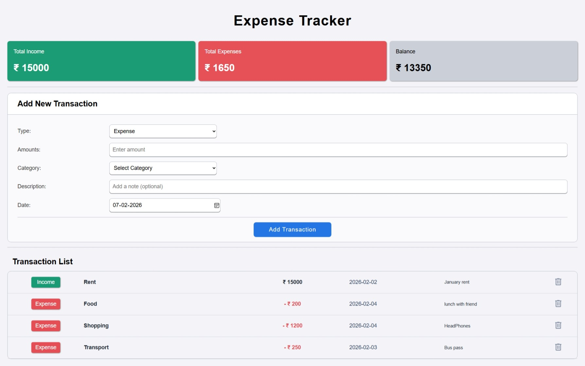

# Expense Tracker App

A simple, clean, and responsive **Expense Tracker** web application that helps you track your **income, expenses, and balance** in real time.  
The app uses **localStorage** to persist data, so transactions remain saved even after refreshing the page.

---

## 🚀 Features

- ➕ Add income and expense transactions
- ❌ Delete transactions
- 💾 Persistent data using **localStorage**
- 📊 Automatic calculation of:
  - Total Income
  - Total Expense
  - Current Balance
- 🔄 Transactions load automatically on page refresh
- 📱 Fully responsive design
- 🎨 Clean UI with shadows on cards and input fields

---

## 🛠️ Tech Stack

- **HTML5** – Structure
- **CSS3** – Styling & responsiveness (media queries)
- **JavaScript (Vanilla JS)** – Logic & DOM manipulation
- **localStorage API** – Data persistence

---

## 📸 Screenshots

### 🖥️ Desktop View



## 📂 Project Structure

```text
├── assets/
    └── delete-icon.png
    └── ExpenseTrackerScreenshot.jpeg
├── index.html
├── style.css
├── script.js            # App initialization & summary logic
├── addTransaction.js    # Add transaction logic
├── transactions.js      # Render & delete transactions
└── README.md
```

## 👤 Author

**Yashkamal**
